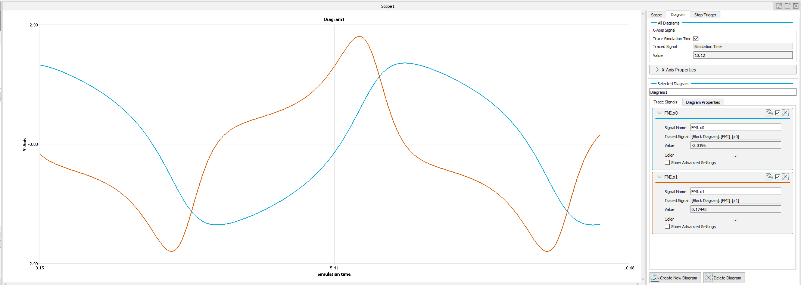

# ISG-virtuos and FMI Standard
[ISG-virtuos](https://www.isg-stuttgart.de/en/products/softwareproducts/isg-virtuos), an established tool for virtual commissioning, supports the FMI standard by enabling the import of CoSimulation-type FMUs. With ISG-virtuos, you can integrate your FMUs into a simulation environment with real-time capability (~ 1 ms), including integration of various fieldbus systems (EtherCAT, ProfiNET, IOLink, Profibus, and many more). Machines and systems can be visualized using powerful 3D simulation.  In addition, [TwinStore](https://www.twinstore.de) offers an exchange platform for simulation models (including FMUs), to enable our customers to conveniently exchange their models.

## Screenshots
### Imported FMU
VanDerPol FMU after import. Screenshot of BlockDiagram.

### BouncingBall FMU with 3D Simulation
GIF of Bouncingball visualized with a simple 3D Simulation in ISG-virtuos

### VanDerPol FMU recoded with Scope
VanDerPol FMU, screenshot of scoped Outputs in ISG-virtuos

# FMU Import compatibility for ISG-virtuos
The compatibility of ISG-virtuos is testet with following FMUs.

## Reference FMUs v0.0.34
| Name          | FMU Version | Platform      | FMU Type | Comment |
| ------------- | ------------- | ----- | ----- | ---- |
| Bouncing Ball | 2.0 | win64 | CS |
| Dahlquist | 2.0 | win64 |CS |
| VanDerPol | 2.0 | win64 |CS |
| Step | 2.0 | win64 |CS | Stops the simulation after 10 seconds
| Bouncing Ball | 3.0 | x86_64-windows | CS |
| Dahlquist | 3.0 | x86_64-windows | CS |
| Feedthrough | 3.0 | x86_64-windows | CS |
| Step | 3.0 | x86_64-windows | CS | Stops the simulation after 10 seconds
| VanDerPol | 3.0 | x86_64-windows | CS |
